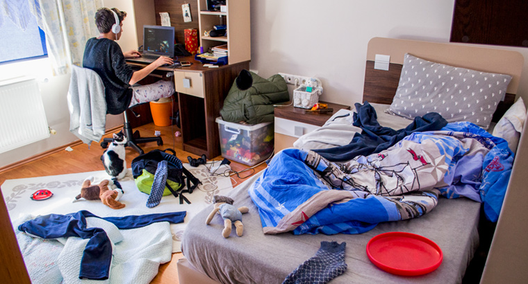

### DISTORSION COLLECTIVE 
Présentation du projet de William Dubois et Ghislain
## LE THÈME DU TEMPS 
L’expérience commence par la perspective d’un élève qui va commencer ses premiers cours en ligne durant le confinement avec enthousiasme.
Les complications commencent à partir du moment où le professeur se présente, que les travaux s’accumulent, que la personne vit un sentiment d’isolement, et le tout dans une boucle sans fin qui s’accélère périodiquement et qui l’affecte mentalement. À la fin, par un débordement d’anxiété, l’interacteur est appelé à se déconnecter. Se faisant, toute la scène devient noire à l'exception de l’ordinateur (éteint) qui reste toujours visible.
## L'AMBIANCE 
Pour ce qui est de l'ambiance elle évoque un sentiment de stress et de solitude pour que l'interacteur se sente peu confortable.

## INSTALLATION
Il y a une chambre d'adolescent et une video est projecter avec un projecteur

## PROGRAMMES
- Modélisation 3D
- Conception vidéo 
- Conception sonore
## ATTENDU DE L'INTERACTEUR
Il est attendu de l'Interacteur de se promener dans l'installation pour que les capteurs et le projecteur s'enclenche et que l'histoire démarre.  

